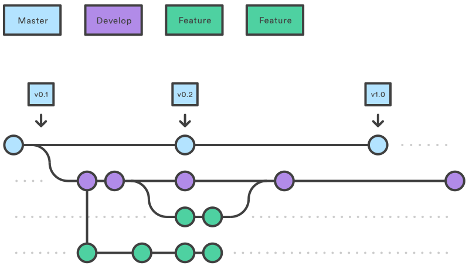
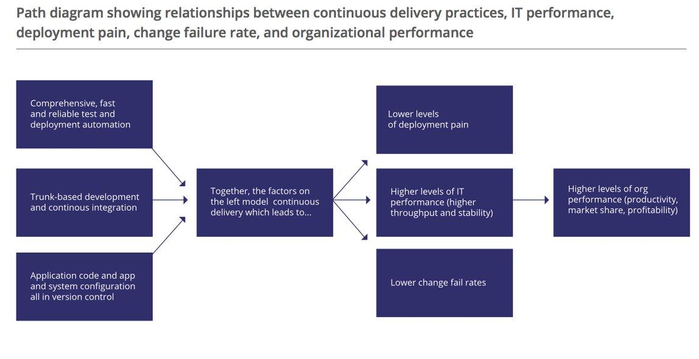

# Trunk-Based Dev

---

## INTRODUCTION!

---

## TL;DR

### /tiː ˌel diː ˈɑr/

@css[text-white fragment](No Branches)
@css[text-white fragment](Integrate Early)
@css[text-white fragment](Test, Test, Test!)

---

## Some Terminology

- Git
- Commit
- Branches
- Git-Flow
- Pull Requests
- Feature Switches

Note:

- Open-source Version Control System.
- A selection of changes consisting of edits, removals and deletions.
- A movable pointer which points at a specific git commit.
- A software dev methodology which uses different feature branches to allow concurrent change.
- A code review mechanism whereby changes are pushed to a remote branch and then discussed via comments and messages.
- A method of branching by "abstraction" whereby features can be turned on and off using flags.

---

---

## GitFlow

---

## What Problem Does it Solve?

- Enables parallel development
- Enables collaboration using PRs
- Provides a "Staging Area" for release
- Supports hot-fixes

---

## Some Anti-Patterns

---

## Anti-Pattern #1: The "Long-Lived Feature Branch"

- Delayed feedback
- Reduced visibility
- Reduced confidence
- "Merge Hell"

Note:

Parallel dev is great, but only if you integrate frequently. Here, branches might span days.

- The longer the branch, the longer the feedback in a production-like environment.
- The longer the branch, the lower the amount of change visibility
- The longer they deviate from develop, the harder to reconcile.
- Results in delayed features.

---

## Anti-Pattern #2: The "Branch Per Environment"

- False sense of security
- Easy to get out of step
- Complicated

Note:

One of the common patterns associated with GitFlow, only deploy when "ready" via merge to dev branch.

- As we're building anew for every branch, how can you be confident that your artifacts are the same?
- Hotfixes to master resulting in develop/master getting out of step.
- The cognitive load of trying to unpick branches is high.

---

## Anti-Pattern #3: The "Costly Pull Request"

- Delayed feedback
- Context-switching
- Increased cycle time

Note:

One of the main tenets of GitFlow is the idea of using pull requests to collaborate on work. It was originally designed for siloed teams, working in isolation (and may be anonymous).

- After the horse has bolted. Design decisions already made.
- Introduces an overhead for developers to have to re-work.
- Review delay can increase the time for a feature getting released. It can also result in more work in progress which adds to the complexity of the sprint.

---

## Trunk-Based Development

---

## COMPARISON!

---?image=assets/img/git-flow.png&size=contain
---?image=assets/img/trunk-based-dev.png&size=contain

Note:

- Thought it would be easier to explain with a comparison between the 2 approaches.
- Here all commits are made straight to master.
- Every single commit is made with the assumption that it might go live.

---

## How Does This Help?

- Fast feedback
- No more "Merge Hell"
- Increased visibility
- Reliable deployments
- Decreased cycle time

Note:

- Every commit gets deployed to a test environment _quickly_.
- Every commit must be integrated locally before pushing.
- Everyone is working on the same branch, more visibility of changes.
- With trunk-based development, you build once and promote.

---

## But What About?

- Collaboration
- Unfinished Work

Note:

- Early feedback is better than late. Pair programming gives us this.
- If work isn't ready to be released it can easily be hidden behind a feature flag/switch/toggle. We can dig into this shortly!

---

## TBD In

---

## Git Etiquette (**#Gitiquette**)

> Just because there are no branches, doesn't mean there are no conflicts!

Note:

- Switching to trunk-based development is not a silver bullet.
- Working on the same branch means that there will be times that concurrent change needs to be orchestrated.
- There are some decisions that need to be made for the team!

---

## Merge or Rebase?

Note:

- The question of merge/rebase is a question of maintaining commit context or favouring a linear timeline.
- When working with trunk-based development the "context" of short-lived branches and merge history is largely redundant, but this should be at the discretion of the team.

---

## Squash?

Note:

- Git squashing allows multiple commit messages to be squashed together into a single item.
- This can be a useful technique to simplify git histories when doing TBD.

---

## What About Story Context?

Note:

- Developers often create feature branches named after stories.
- Without this in place it can be useful to include story numbers in commit messages.

---

## Branches Still Have Their Place!

Note:

- Trunk-Based Development is not a silver bullet.
- It is a _proven_ mechanism for decreasing cycle time and getting code integrated early, building quality in.
- But short-lived feature branches can still have a place. Experimental code, code that can't be toggled and demonstration code are all relevant candidates for feature-branches.

---

Note:

- Annual report.
- Represents data from over 31,000 participants in tech.
- Identifies key findings and recommendations for technologists.
- All findings beyond scope of this, can send a link.

---

Note:

- Its key findings are that tbd is a leading indicator of high performance.
- Why? Because of the reduced cycle time involved from writing code -> production.

---

## Questions?

---

## Thanks!
